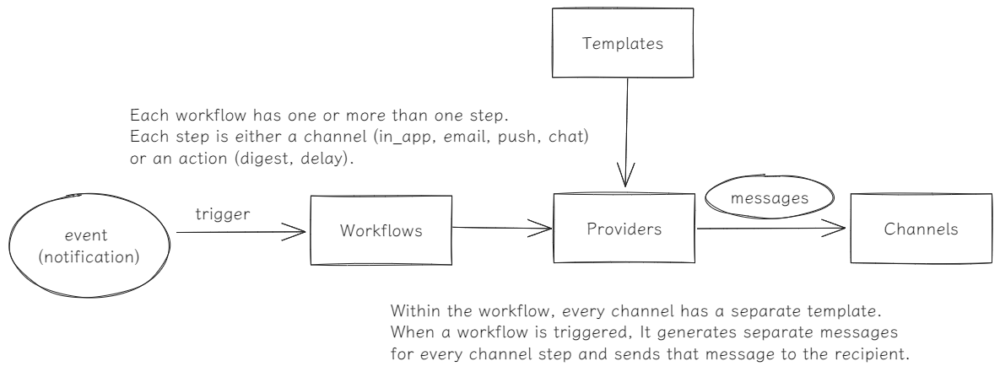

# eclipse



1. Trigger & Workflows

Problem: Tools like Pipedream are great for quickly coding up a workflow that interacts with external services, but cannot easily access internal databases or internal services without opening them up to the internet or building proxies.

Solution: With Internal Workflow, your workflows are written in your existing codebase and run in your existing infrastructure, but are coordinated through the Internal Workflow service, making it easy to trigger workflows when external events happen and make authenticated requests to APIs.

Let's start with a simple one: syncing GitHub issues to a database

```typescript
import { Workflow } from "@internal/workflows";
import { issues } from "@internal/github";

import { upsertIssue, deleteIssue } from "./db.server";

new Workflow({
  title: "Sync issues to internal database",
  version: "1.0.0",
  trigger: issues({ repo: "calcom/cal.com" }),
  run: async ({ action, data }, ctx, io) => {
    if (action === "deleted") {
      await deleteIssue(data.id);
    } else {
      await upsertIssue(data);
    }
  }
}).listen();
```

## Command

`npx nx run-many -t {script: lint, build, ...}`

---

- [UML - State Machine Diagrams](https://www.uml-diagrams.org/state-machine-diagrams.html#choice-pseudostate)
- [Introduction to state machines and statecharts](https://xstate.js.org/docs/guides/introduction-to-state-machines-and-statecharts/)
- [Actor Model](https://www.brianstorti.com/the-actor-model/)
- [novu - architecture](https://docs.novu.co/getting-started/how-novu-works#architecture)
- [trigger.dev](https://github.com/triggerdotdev/trigger.dev)